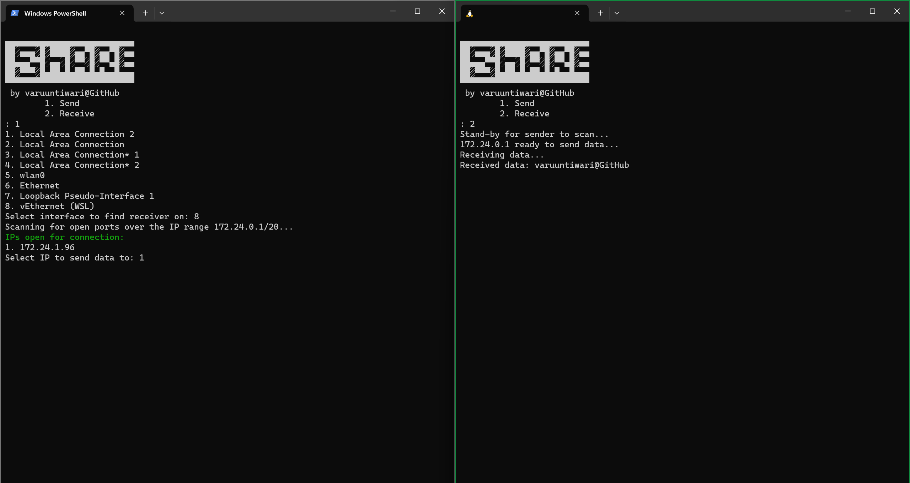

# share
command-line utility to share files in your local network

## Installation
- Clone the repository to a local working directory with `git clone https://github.com/varuuntiwari/share`.
- Ensure that you have the latest Go version installed on the machine.
- Run the command `go build .` in the root of the cloned repository.
- Execute the compiled binary and follow the steps.
- Make sure to give permission for the binary to access the required network through the firewall.
- If unsure about which network to give access to, select all. There's no danger ;)

## Usage
The program will scan for all network interfaces available on the network when sending a file. Ensure you select the interface which is connected to your WiFi or LAN and also that you have the target machine on the same network.

The program will automatically find the device which is open for receiving files from the program. Do not send the file before opening the target machine for receiving the file(s).

## Example usage
